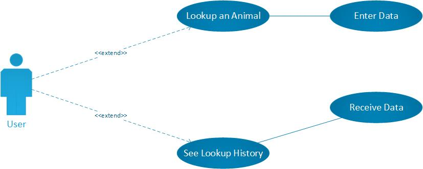
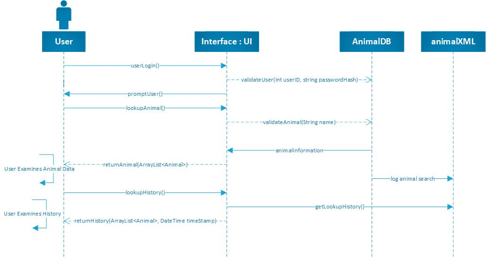
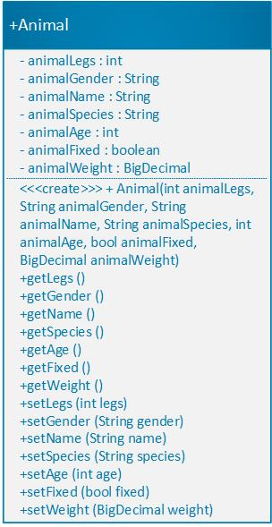

# Java 2 Final Project Fall 2020
In this Project I will exercise and demonstrate Java programming utilizing
Unit-Testing, Server-Side development, inputs/outputs and UI.

## UML Diagrams

### Use Case Diagram

### Sequence Diagram

### Class Diagram
